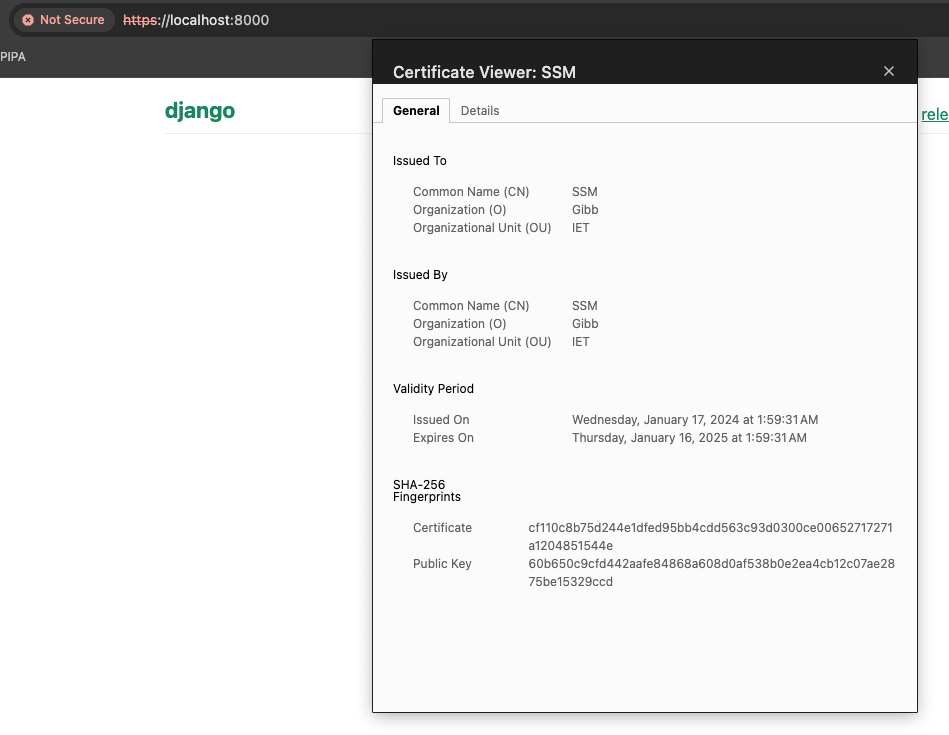
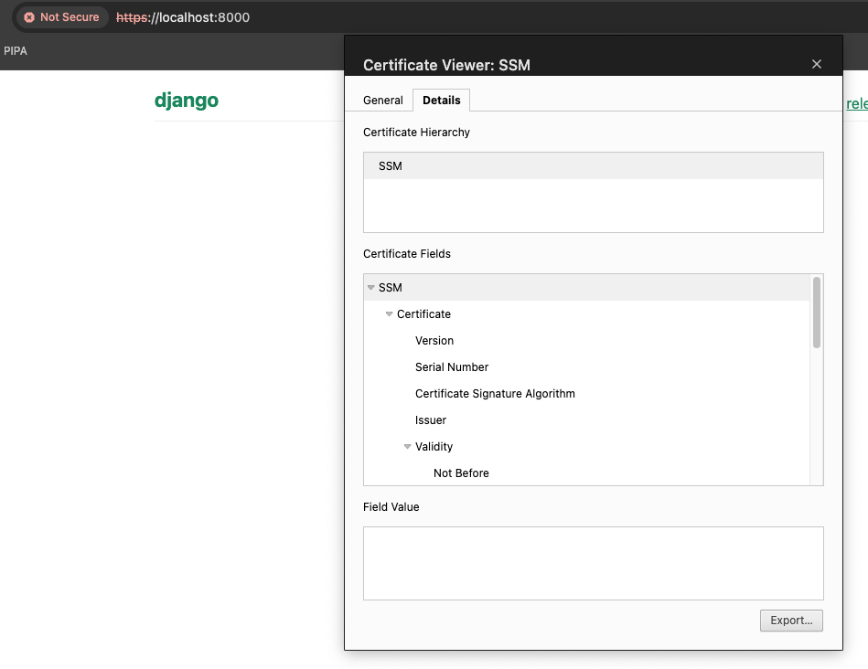
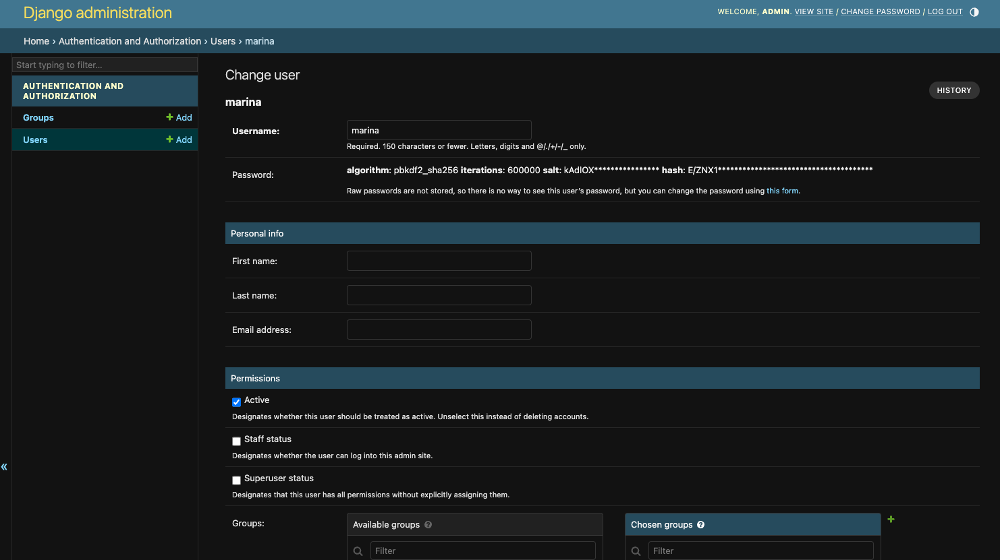
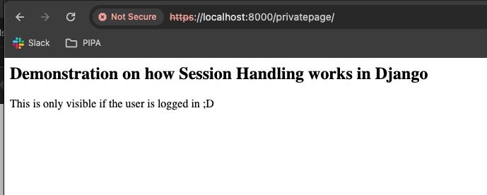
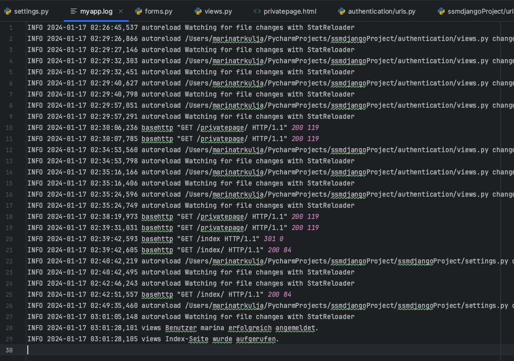

# 183 Dokumentation

## **Verschlüsselte** Netzwerk-Kommunikation (SSL/TLS, self-signed i.O.).





Wir haben ein Self-signed Zertifikat implementiert

terminal

```python
openssl req -x509 -newkey rsa:4096 -keyout key.pem -out cert.pem -days 365
```

Dannach Anweisungen befolgt und alle gefragten Daten eingegeben.

settings.py

```python
INSTALLED_APPS = [
    'django.contrib.admin',
    'django.contrib.auth',
    'django.contrib.contenttypes',
    'django.contrib.sessions',
    'django.contrib.messages',
    'django.contrib.staticfiles',
    'authentication',
    'sslserver',
]

SECURE_SSL_REDIRECT=True

CSRF_COOKIE_SECURE=True

SESSION_COOKIE_SECURE=True
```

terminal

```python
pip install django-sslserver
```

terminal

```python
python manage.py runsslserver 0.0.0.0:8000 --certificate cert.pem --key key.pem
```

---

## • **Login** mit *User* und *Passwort,* sowie *Logout*.

Das Login und Logout wurde mit den standardmässigen Django Usermodel implementiert.

Django erstellt automatisch eine sqllite datenbank welche für das speichern der Daten verwendet wird. Die gespeicherten Daten können im Adminspace als superuser eingesehen werden und sind somit geschützt.

superuser: 

username: admin

pw: admin



oder in der Konsole ausgeben: 

```python
sqlite3 db.sqlite3

SELECT * FROM auth_user;
```

---

## • Session-Handling

Session-Handling nach Login (z.B. mit Cookies).

Wir haben das **django.contrib.auth.views.LoginView** also die standard loginview von django verwendet um das login auszuführen. Hierbei setzt django automatisch entsprechende Session-Cookies welche wir in diesem beispiel verwendet haben um eine Seite nur für autentifizierte/ eingeloggte Benutzer zugänglich zu machen.

views.py

```python
@login_required
def privatepage(request):
    return render(request, 'privatepage.html')
```

mit **`request.user.is_authenticated`** kann in der view geprüft werden ob ein Benutzer eingeloggt ist und entsprechend eine custom Logik dazu schreiben. 



Bei der LogoutView werden die Session-Cookies gelöscht und somit ist die privatepage nicht mehr für aufrufbar.

---

## • Persistente **Passwortspeicherung**, geschützt gegen Einsicht auch bei Entwendung der gespeicherten Daten.

Django speichert Passwörter nicht als Klartext, sondern verwendet Hashing-Algorithmen. Standardmässig wird **`pbkdf2_sha256`** verwendet, einer der besten verfügbaren Hashing-Algorithmen.

Dies kann überprüft werden indem man einen neuen Benutzer registriert und dannach in Adminpannel als Superuser die “User” Tabelle öffnet und nach dem entsprechenden Benutzer und seinem Passwort sucht. Dort wird das Passwort nicht als Klartext ersichtlich sein sondern gehasht.

Wenn die Datenbank aus irgend einem Grund gehackt wird, sind die Passwörter der Benutzer nicht einer so grossen Gefahr ausgesetz wie wenn sie als Klartext genau so in der Tabelle standen. Die Hacker müssten die Passwörter einzeln “enthashen”.

---

## • Ausgabe relevanter *formatierter* **Log**-Meldungen mit mind. zwei *Logstufen* in Datei oder STDOUT/ERR.

Hierfür verwenden wir das in python eingebaute logging modul.

```python
# settings.py

LOGGING = {
    'version': 1,
    'disable_existing_loggers': False,
    'handlers': {
        'console': {
            'class': 'logging.StreamHandler',
        },
    },
    'loggers': {
        '': {  
            'handlers': ['console'],
            'level': 'INFO',
        },
    },
}
```

folgendermassen wurde das logging aufgerufen:

```python
def index(request):
    logger.info('Index-Seite wurde aufgerufen.')
    return render(request, 'index.html')

@login_required
def privatepage(request):
    logger.info(f'Private Seite aufgerufen von Benutzer: {request.user.username}')
    return render(request, 'privatepage.html')
```

Loggs werden in der Konsole angezeigt:


oder im File myapp.log:

```python
LOGGING = {
    'version': 1,
    'disable_existing_loggers': False,
    'formatters': {
        'verbose': {
            'format': '{levelname} {asctime} {module} {message}',
            'style': '{',
        },
        'simple': {
            'format': '{levelname} {message}',
            'style': '{',
        },
    },
    'handlers': {
        'console': {
            'class': 'logging.StreamHandler',
            'formatter': 'simple',
        },
        'file': {
            'class': 'logging.FileHandler',
            'filename': 'myapp.log',
            'formatter': 'verbose',
        },
    },
    'loggers': {
        '': {
            'handlers': ['console', 'file'],
            'level': 'INFO',
        },
    },
}
```


